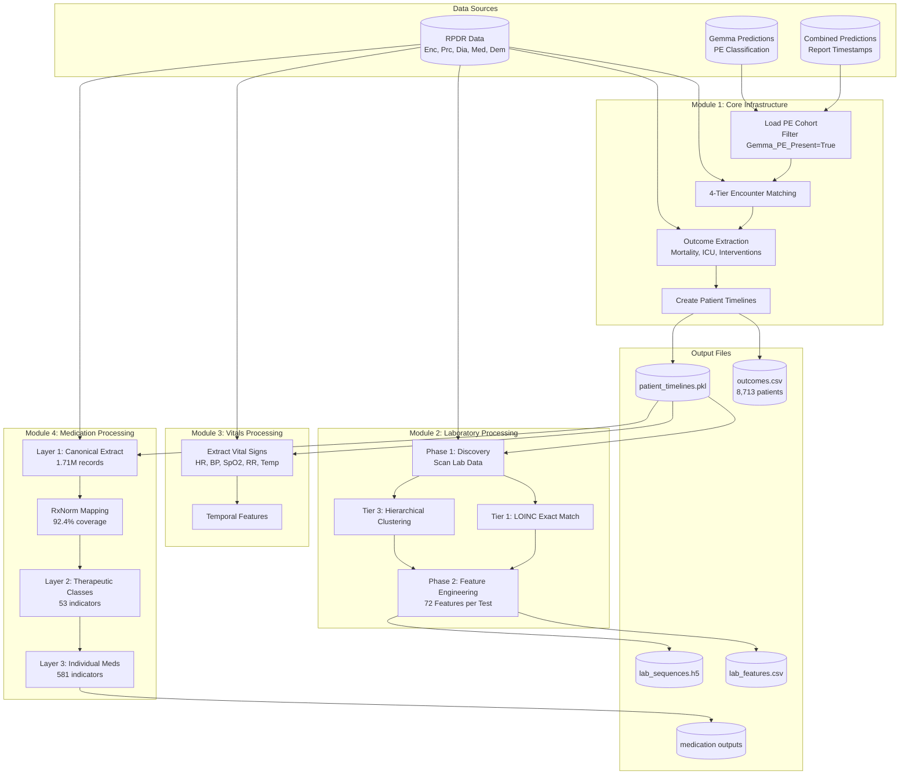
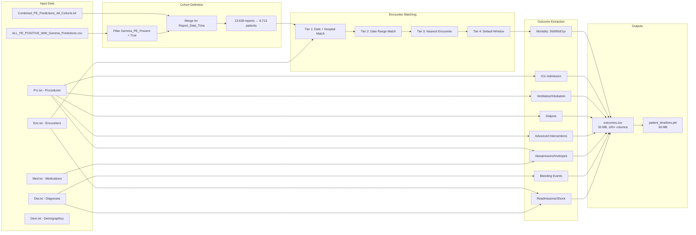
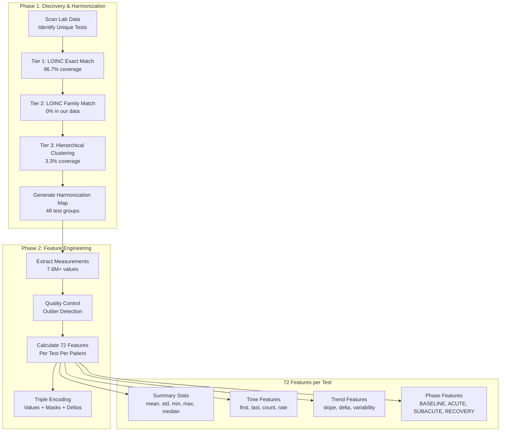
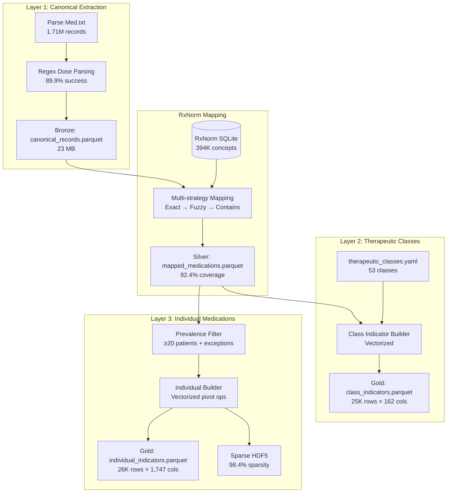
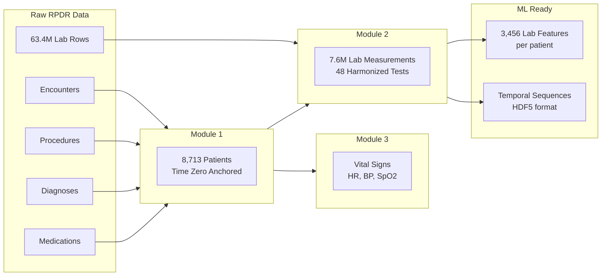

# System Architecture
*Last Updated: 2025-12-11*

## High-Level Pipeline Overview



## Module 1: Core Infrastructure



## Module 2: Laboratory Processing



## Module 4: Medication Processing



## Data Flow Architecture



## File Structure

```
TDA_11_25/
├── Data/
│   ├── ALL_PE_POSITIVE_With_Gemma_Predictions.csv  # Cohort source
│   ├── Combined_PE_Predictions_All_Cohorts.txt     # Timestamps
│   ├── Enc.txt                                      # Encounters
│   ├── Prc.txt                                      # Procedures
│   ├── Dia.txt                                      # Diagnoses
│   ├── Med.txt                                      # Medications
│   └── Dem.txt                                      # Demographics
│
├── module_1_core_infrastructure/
│   ├── module_01_core_infrastructure.py            # Main script (1,400+ lines)
│   └── outputs/
│       ├── outcomes.csv                            # 33 MB, 8,713 patients
│       └── patient_timelines.pkl                   # 36 MB
│
├── module_2_laboratory_processing/
│   ├── module_02_laboratory_processing.py          # Main script (1,230 lines)
│   ├── loinc_matcher.py                            # LOINC database matching
│   ├── unit_converter.py                           # Lab unit conversions
│   ├── hierarchical_clustering.py                  # Tier 3 clustering
│   ├── visualization_generator.py                  # Interactive dashboards
│   ├── Loinc/                                      # LOINC database files
│   └── outputs/
│       ├── full_lab_features.csv                   # 35 MB
│       └── full_lab_sequences.h5                   # 646 MB
│
├── module_3_vitals_processing/
│   ├── extractors/
│   ├── tests/
│   └── outputs/
│
└── docs/
    ├── brief.md                                    # Session brief
    ├── architecture.md                             # This file
    ├── progress.md                                 # Progress tracker
    └── plans/                                      # Implementation plans
```

## Key Technical Decisions

| Decision | Choice | Rationale |
|----------|--------|-----------|
| Cohort Source | Gemma PE-Positive | Most accurate PE classification |
| Time Zero | Report_Date_Time | CT PE study timestamp |
| Encounter Matching | 4-Tier Strategy | 99.5% Tier 1 match rate |
| Lab Harmonization | 3-Tier LOINC | 100% coverage with clinical accuracy |
| Feature Engineering | 72 features/test | Comprehensive temporal coverage |
| Performance | Pre-group by EMPI | O(1) vs O(n) lookups |

## Version History

| Version | Date | Changes |
|---------|------|---------|
| 3.0 | 2025-12-11 | Module 4 Layers 1-3 complete (581 med indicators, 98.4% sparse) |
| 2.5 | 2025-12-10 | Module 4 Phases 2-4 (RxNorm mapping, 53 therapeutic classes) |
| 2.0 | 2025-11-25 | Expanded cohort (8,713 patients), Module 1 optimization |
| 1.0 | 2025-11-09 | Initial Module 1 + Module 2 complete (3,565 patients) |
