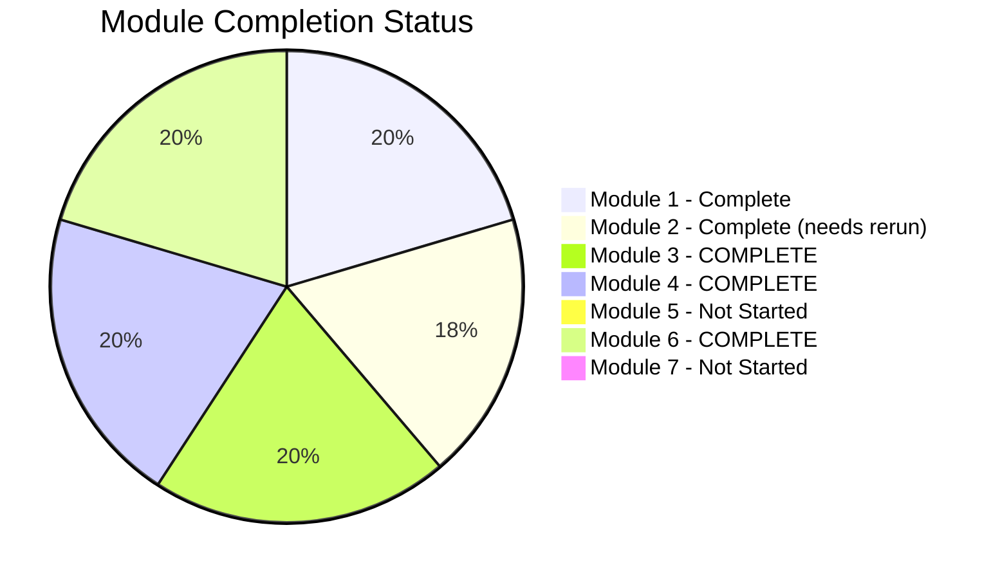
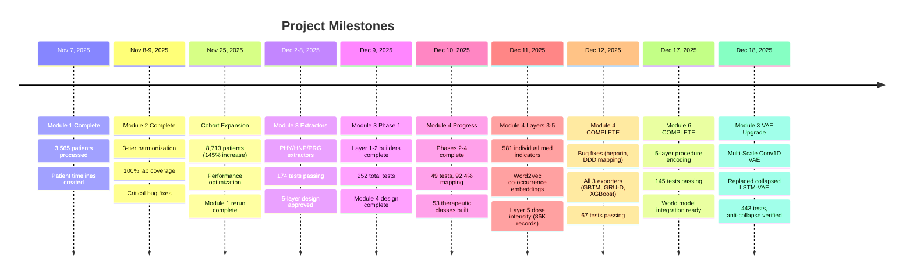

# Project Progress Tracker
*Last Updated: 2025-12-18 (Module 3 Layers 4-5 COMPLETE)*

## Overall Project Status

```mermaid
gantt
    title PE Trajectory Data Analysis Pipeline
    dateFormat  YYYY-MM-DD

    section Module 1
    Core Infrastructure Design     :done, m1d, 2025-11-07, 1d
    Patient Timeline Creation      :done, m1a, 2025-11-07, 1d
    Outcome Extraction            :done, m1b, 2025-11-07, 1d
    Performance Optimization      :done, m1c, 2025-11-25, 1d
    Expanded Cohort Rerun         :done, m1e, 2025-11-25, 1d

    section Module 2
    Lab Harmonization Design       :done, m2d, 2025-11-08, 1d
    Three-Tier LOINC Matching     :done, m2a, 2025-11-08, 1d
    Feature Engineering           :done, m2b, 2025-11-08, 1d
    Bug Fixes & Cleanup           :done, m2c, 2025-11-09, 1d
    Rerun on Expanded Cohort      :pending, m2e, after m1e, 1d

    section Module 3
    Vitals 5-Layer Design          :done, m3d, 2025-12-08, 1d
    Extractors (PHY/HNP/PRG)       :done, m3a, 2025-12-02, 3d
    Layer 1-2 Builders             :done, m3b, 2025-12-09, 1d
    Layer 3 Feature Engineering    :done, m3c, 2025-12-10, 1d
    Layer 4 Multi-Scale VAE        :done, m3e, 2025-12-18, 1d
    Layer 5 World States           :done, m3f, 2025-12-10, 1d

    section Module 4
    Medications 5-Layer Design     :done, m4d, 2025-12-08, 1d
    Phase 1: Setup & RxNorm DB     :done, m4a, 2025-12-09, 1d
    Phase 2: Layer 1 Extraction    :done, m4b, 2025-12-10, 1d
    Phase 3: RxNorm Mapping        :done, m4c, 2025-12-10, 1d
    Phase 4: Layer 2 Classes       :done, m4d2, 2025-12-10, 1d
    Phase 5: Layer 3 Individual    :done, m4e, 2025-12-11, 1d
    Phase 6: Layer 4 Embeddings    :done, m4f, 2025-12-11, 1d
    Phase 7: Layer 5 Dose          :done, m4g, 2025-12-11, 1d
    Phase 8: Exporters + Bug Fixes :done, m4h, 2025-12-12, 1d

    section Module 6
    Procedures 5-Layer Design      :done, m6d, 2025-12-11, 1d
    Phase 1: Setup & Layer 1       :done, m6a, 2025-12-17, 1d
    Phase 2: Code Mapping          :done, m6b, 2025-12-17, 1d
    Phase 3: Layer 2 CCS           :done, m6c, 2025-12-17, 1d
    Phase 4: Layer 3 PE Features   :done, m6e, 2025-12-17, 1d
    Phase 5: Layer 4 Embeddings    :done, m6f, 2025-12-17, 1d
    Phase 6: Layer 5 World Model   :done, m6g, 2025-12-17, 1d
    Phase 7: Exporters             :done, m6h, 2025-12-17, 1d
    Phase 8: Validation & Docs     :done, m6i, 2025-12-17, 1d

    section Module 5
    Diagnoses Processing          :pending, m5a, after m6i, 2d

    section Module 7
    Trajectory Engineering        :pending, m7a, after m5a, 3d
```

## Module Completion Status



## Detailed Module Status

### Module 1: Core Infrastructure - COMPLETE ✅

| Task | Status | Date | Notes |
|------|--------|------|-------|
| Design patient timeline structure | Complete | Nov 7 | PatientTimeline dataclass |
| Implement cohort loading | Complete | Nov 7 | Gemma PE-positive filter |
| 4-tier encounter matching | Complete | Nov 7 | 99.5% Tier 1 match rate |
| Mortality extraction | Complete | Nov 7 | 30d/90d/1yr windows |
| ICU admission extraction | Complete | Nov 7 | CPT codes for critical care |
| Ventilation extraction | Complete | Nov 7 | Intubation + mechanical vent |
| Dialysis extraction | Complete | Nov 7 | CRRT, HD, PD codes |
| Advanced interventions | Complete | Nov 7 | IVC filter, CDT, ECMO, etc. |
| Vasopressor/inotrope extraction | Complete | Nov 7 | 10 agent categories |
| Bleeding event extraction | Complete | Nov 7 | ICH, GI, acute blood loss |
| Readmission/shock extraction | Complete | Nov 7 | 30-day windows |
| Performance optimization | Complete | Nov 25 | Pre-grouping by EMPI |
| tqdm progress bars | Complete | Nov 25 | All 10 loops |
| Expanded cohort rerun | Complete | Nov 25 | 8,713 patients |

**Output:** 8,713 patients, 33 MB outcomes.csv, 36 MB patient_timelines.pkl

### Module 2: Laboratory Processing - COMPLETE ✅ (needs rerun)

| Task | Status | Date | Notes |
|------|--------|------|-------|
| Tier 1: LOINC exact matching | Complete | Nov 8 | 96.7% coverage |
| Tier 2: LOINC family matching | Complete | Nov 8 | 0% (expected) |
| Tier 3: Hierarchical clustering | Complete | Nov 8 | 3.3% coverage |
| Harmonization map generation | Complete | Nov 8 | 48 test groups |
| Phase 2: Feature extraction | Complete | Nov 8 | 72 features/test |
| Bug fix: dictionary overwrite | Complete | Nov 9 | Critical fix |
| POC variant consolidation | Complete | Nov 9 | 26 tests merged |
| HDF5 saving fix | Complete | Nov 9 | Name sanitization |
| Interactive visualizations | Complete | Nov 9 | Plotly dashboards |
| Rerun on expanded cohort | Pending | - | 8,713 patients |

**Previous Output:** 3,565 patients, 35 MB features.csv, 646 MB sequences.h5

### Module 3: Vitals Processing - COMPLETE ✅

| Task | Status | Date | Notes |
|------|--------|------|-------|
| 5-Layer Architecture Design | Complete | Dec 8 | Approved design doc |
| Submodule 3.1: PHY Extractor | Complete | Nov 25 | 39 tests, structured vitals |
| Submodule 3.2: HNP Extractor | Complete | Dec 2 | 74 tests, H&P NLP |
| Submodule 3.3: PRG Extractor | Complete | Dec 8 | 61 tests, Progress notes NLP |
| Submodule 3.4: Layer 1 Builder | Complete | Dec 9 | 17 tests, canonical records |
| Submodule 3.5: Layer 2 Builder | Complete | Dec 9 | 17 tests, hourly grid + HDF5 |
| Processing helpers | Complete | Dec 9 | unit_converter, qc_filters, temporal_aligner |
| Submodule 3.6: Layer 3 Features | Complete | Dec 10 | 71 tests, rolling stats, trends, variability |
| Submodule 3.7: FPCA Builder | Complete | Dec 10 | 4 tests, 10 components × 7 vitals |
| Submodule 3.8: Multi-Scale VAE | Complete | Dec 18 | 16 tests, 4 temporal branches, anti-collapse |
| Submodule 3.9: DTW Clustering | Complete | Dec 10 | 1 test, validation baseline |
| Submodule 3.10: HDBSCAN Clustering | Complete | Dec 10 | 3 tests, 102-dim embeddings |
| Submodule 3.11: Layer 4 Builder | Complete | Dec 18 | Orchestrates all Layer 4 components |
| Submodule 3.12: Layer 5 Builder | Complete | Dec 10 | 5 tests, 100-dim world states |

**Multi-Scale Conv1D VAE (Dec 18):**
- Replaced LSTM-VAE which suffered from posterior collapse
- 4 parallel convolutional branches for multi-scale temporal patterns
- Anti-collapse measures: cyclical β-annealing, free bits (2.0), per-branch loss
- Results: mu_std=0.42 (healthy), logvar_mean=-3.9 (not collapsed)

**Tests:** 443 total
**Output:**
- `outputs/layer1/canonical_vitals.parquet` (3.5M records)
- `outputs/layer2/hourly_grid.parquet`, `hourly_tensors.h5` (7,689 × 745 × 7)
- `outputs/layer3/timeseries_features.parquet` (5.7M × 315)
- `outputs/layer3/summary_features.parquet` (7,689 × 4,426)
- `outputs/layer4/fpca_scores.parquet`, `vae_latents.h5`, clusters
- `outputs/layer5/world_states.h5` (7,689 × 745 × 100)

### Module 4: Medication Processing - COMPLETE ✅

| Task | Status | Date | Notes |
|------|--------|------|-------|
| 5-Layer Architecture Design | Complete | Dec 8 | 53 therapeutic classes |
| Phase 1: Setup | Complete | Dec 9 | RxNorm DB, config files |
| Phase 2: Layer 1 Extraction | Complete | Dec 10 | 25 tests, 89.9% parsing |
| Phase 3: RxNorm Mapping | Complete | Dec 10 | 10 tests, 92.4% record mapping |
| Phase 4: Layer 2 Classes | Complete | Dec 10 | 14 tests, 53 classes + union_of |
| Phase 5: Layer 3 Individual | Complete | Dec 11 | 4 tests, 581 meds, 98.4% sparse |
| Phase 6: Layer 4 Embeddings | Complete | Dec 11 | 5 tests, 2 embedding types |
| Phase 7: Layer 5 Dose Intensity | Complete | Dec 11 | 86K records, 97.2% DDD coverage |
| Phase 8: Exporters & Validation | Complete | Dec 12 | GBTM, GRU-D, XGBoost exports |
| Bug Fixes | Complete | Dec 12 | Heparin mapping, DDD expansion |

**Bug Fixes Applied (Dec 12):**
- Fixed PIN→IN ingredient lookup (`has_form` relationship)
- Fixed union class computation (cv_vasopressor_any, cv_inotrope_any)
- Expanded DDD mappings (hydromorphone, bumetanide, unit variants)
- **Results:** Anticoag 55.6%→62.4%, DDD 73.7%→97.2%

**Tests:** 67 total
**Output:**
- `data/bronze/canonical_records.parquet` (23 MB, 1.71M records)
- `data/silver/mapped_medications.parquet` (32 MB, 92.4% mapped)
- `data/gold/therapeutic_classes/class_indicators.parquet` (25K patient-windows)
- `data/gold/individual_indicators/individual_indicators.parquet` (26K × 1,747)
- `data/gold/dose_intensity/dose_intensity.parquet` (86K records)
- `data/embeddings/medication_embeddings.h5` (769 co-occur + 1,582 PK)
- `exports/gbtm_medication_*.csv` (54K rows × 14 features)
- `exports/grud_medications.h5` (8,394 × 168 × 12 tensor)
- `exports/xgboost_medication_features.parquet` (8,219 × 831 features)

### Module 6: Procedure Encoding - COMPLETE ✅ (NEW)

| Task | Status | Date | Notes |
|------|--------|------|-------|
| 5-Layer Architecture Design | Complete | Dec 11 | Design doc approved |
| Phase 1: Setup & Layer 1 | Complete | Dec 17 | 7 temporal flags, canonical extraction |
| Phase 2: Code Mapping | Complete | Dec 17 | CCS + SNOMED, fuzzy matching |
| Phase 3: Layer 2 CCS Indicators | Complete | Dec 17 | 27 tests, surgical risk classification |
| Phase 4: Layer 3 PE Features | Complete | Dec 17 | 24 tests, 63+ clinical features |
| Phase 5: Layer 4 Embeddings | Complete | Dec 17 | 17 tests, HDF5 output |
| Phase 6: Layer 5 World Model | Complete | Dec 17 | 29 tests, discretion-weighted actions |
| Phase 7: Exporters | Complete | Dec 17 | 9 tests, GBTM/GRU-D/XGBoost |
| Phase 8: Validation & Docs | Complete | Dec 17 | 12 tests, README |

**Tests:** 145 total
**Output:**
- `data/bronze/canonical_procedures.parquet` (22M records target)
- `data/silver/mapped_procedures.parquet` (85% CCS mapping target)
- `data/gold/ccs_indicators/` (Layer 2)
- `data/gold/pe_procedure_features/` (Layer 3, 63+ features)
- `data/embeddings/procedure_embeddings.h5` (Layer 4)
- `data/gold/world_model_states/` (Layer 5 - static, dynamic, actions)
- `exports/gbtm_procedures.csv`
- `exports/grud_procedures.h5`
- `exports/xgboost_procedure_features.parquet`

### Modules 5 & 7: Future Work

| Module | Status | Description |
|--------|--------|-------------|
| Module 5 | Pending | Diagnoses processing |
| Module 7 | Pending | Trajectory feature engineering |

## Key Milestones



## Cohort Statistics

| Metric | Previous (Nov 9) | Current (Nov 25+) | Change |
|--------|------------------|-------------------|--------|
| Total Patients | 3,565 | 8,713 | +145% |
| PE Events | 3,565 | 8,713 | +145% |
| 30d Mortality | ~10% | 11.2% | +1.2pp |
| ICU Admission | ~35% | 35.8% | +0.8pp |
| Vasopressor Use | ~25% | 26.7% | +1.7pp |
| Lab Measurements | 7.6M | TBD | - |
| Medication Records | - | 1.71M | New |
| Unique Medications | - | 10,879 | New |

## Test Coverage Summary

| Module | Test Files | Tests | Status |
|--------|------------|-------|--------|
| Module 1 | - | - | No formal tests |
| Module 2 | - | - | No formal tests |
| Module 3 | 16 files | 443 | ✅ All Pass |
| Module 4 | 8 files | 67 | ✅ All Pass |
| Module 6 | 10 files | 145 | ✅ All Pass |
| **Total** | **34 files** | **655** | **✅ All Pass** |

## Technical Debt & Issues

| Issue | Severity | Status | Notes |
|-------|----------|--------|-------|
| HDF5 group name collision | Low | Fixed | Sanitize names with `/` |
| Dictionary overwrite bug | Critical | Fixed | Use groupby aggregation |
| POC variant fragmentation | Medium | Fixed | Manual consolidation |
| Module 2 needs rerun | Medium | Pending | On expanded cohort |
| Pickle loading context | Low | Fixed | Inject class into `__main__` |

## Next Actions

1. **Immediate:** Rerun Module 3 Layer 4 with Multi-Scale VAE (150 epochs) to refresh outputs
2. **Short-term:** Module 2 Rerun on expanded cohort (8,713 patients)
3. **Medium-term:** Module 5 - Diagnoses processing
4. **Long-term:** Module 7, ML model development, World Model training

---

*Version: 9.0 | Updated: 2025-12-18*
