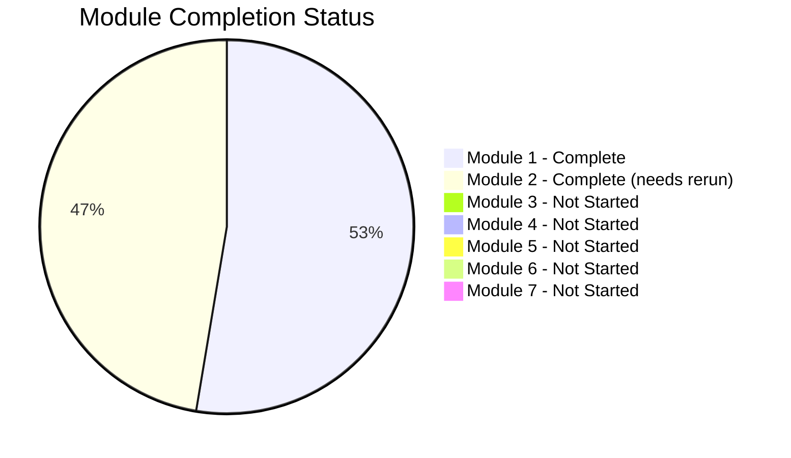
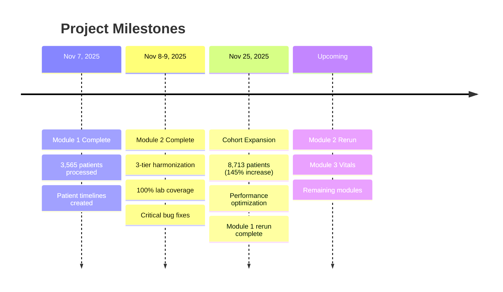

# Project Progress Tracker
*Last Updated: 2025-11-25*

## Overall Project Status

```mermaid
gantt
    title PE Trajectory Data Analysis Pipeline
    dateFormat  YYYY-MM-DD

    section Module 1
    Core Infrastructure Design     :done, m1d, 2025-11-07, 1d
    Patient Timeline Creation      :done, m1a, 2025-11-07, 1d
    Outcome Extraction            :done, m1b, 2025-11-07, 1d
    Performance Optimization      :done, m1c, 2025-11-25, 1d
    Expanded Cohort Rerun         :done, m1e, 2025-11-25, 1d

    section Module 2
    Lab Harmonization Design       :done, m2d, 2025-11-08, 1d
    Three-Tier LOINC Matching     :done, m2a, 2025-11-08, 1d
    Feature Engineering           :done, m2b, 2025-11-08, 1d
    Bug Fixes & Cleanup           :done, m2c, 2025-11-09, 1d
    Rerun on Expanded Cohort      :pending, m2e, after m1e, 1d

    section Module 3
    Vitals Processing Design       :pending, m3a, after m2e, 1d
    Vital Sign Extraction         :pending, m3b, after m3a, 2d
    Temporal Features             :pending, m3c, after m3b, 1d

    section Module 4
    Medications Processing         :pending, m4a, after m3c, 2d

    section Module 5
    Diagnoses/Procedures          :pending, m5a, after m4a, 2d

    section Module 6
    Temporal Alignment            :pending, m6a, after m5a, 2d

    section Module 7
    Trajectory Engineering        :pending, m7a, after m6a, 3d
```

## Module Completion Status



## Detailed Module Status

### Module 1: Core Infrastructure

| Task | Status | Date | Notes |
|------|--------|------|-------|
| Design patient timeline structure | Complete | Nov 7 | PatientTimeline dataclass |
| Implement cohort loading | Complete | Nov 7 | Gemma PE-positive filter |
| 4-tier encounter matching | Complete | Nov 7 | 99.5% Tier 1 match rate |
| Mortality extraction | Complete | Nov 7 | 30d/90d/1yr windows |
| ICU admission extraction | Complete | Nov 7 | CPT codes for critical care |
| Ventilation extraction | Complete | Nov 7 | Intubation + mechanical vent |
| Dialysis extraction | Complete | Nov 7 | CRRT, HD, PD codes |
| Advanced interventions | Complete | Nov 7 | IVC filter, CDT, ECMO, etc. |
| Vasopressor/inotrope extraction | Complete | Nov 7 | 10 agent categories |
| Bleeding event extraction | Complete | Nov 7 | ICH, GI, acute blood loss |
| Readmission/shock extraction | Complete | Nov 7 | 30-day windows |
| Performance optimization | Complete | Nov 25 | Pre-grouping by EMPI |
| tqdm progress bars | Complete | Nov 25 | All 10 loops |
| Expanded cohort rerun | Complete | Nov 25 | 8,713 patients |

**Current Output:** 8,713 patients, 33 MB outcomes.csv, 36 MB timelines.pkl

### Module 2: Laboratory Processing

| Task | Status | Date | Notes |
|------|--------|------|-------|
| Tier 1: LOINC exact matching | Complete | Nov 8 | 96.7% coverage |
| Tier 2: LOINC family matching | Complete | Nov 8 | 0% (expected) |
| Tier 3: Hierarchical clustering | Complete | Nov 8 | 3.3% coverage |
| Harmonization map generation | Complete | Nov 8 | 48 test groups |
| Phase 2: Feature extraction | Complete | Nov 8 | 72 features/test |
| Bug fix: dictionary overwrite | Complete | Nov 9 | Critical fix |
| POC variant consolidation | Complete | Nov 9 | 26 tests merged |
| HDF5 saving fix | Complete | Nov 9 | Name sanitization |
| Interactive visualizations | Complete | Nov 9 | Plotly dashboards |
| Rerun on expanded cohort | Pending | - | 8,713 patients |

**Previous Output:** 3,565 patients, 35 MB features.csv, 646 MB sequences.h5

### Module 3: Vitals Processing

| Task | Status | Date | Notes |
|------|--------|------|-------|
| Design vital sign extraction | Pending | - | HR, BP, SpO2, RR, Temp |
| Parse flowsheet data | Pending | - | - |
| Calculate temporal features | Pending | - | - |
| Triple encoding | Pending | - | Values + masks + deltas |

### Module 4-7: Future Work

| Module | Status | Description |
|--------|--------|-------------|
| Module 4 | Pending | Medications processing |
| Module 5 | Pending | Diagnoses/procedures |
| Module 6 | Pending | Temporal alignment |
| Module 7 | Pending | Trajectory engineering |

## Key Milestones



## Cohort Statistics

| Metric | Previous (Nov 9) | Current (Nov 25) | Change |
|--------|------------------|------------------|--------|
| Total Patients | 3,565 | 8,713 | +145% |
| PE Events | 3,565 | 8,713 | +145% |
| 30d Mortality | ~10% | 11.2% | +1.2pp |
| ICU Admission | ~35% | 35.8% | +0.8pp |
| Vasopressor Use | ~25% | 26.7% | +1.7pp |
| Lab Measurements | 7.6M | TBD | - |

## Technical Debt & Issues

| Issue | Severity | Status | Notes |
|-------|----------|--------|-------|
| HDF5 group name collision | Low | Fixed | Sanitize names with `/` |
| Dictionary overwrite bug | Critical | Fixed | Use groupby aggregation |
| POC variant fragmentation | Medium | Fixed | Manual consolidation |
| Module 2 needs rerun | Medium | Pending | On expanded cohort |

## Next Actions

1. **Immediate:** Rerun Module 2 on 8,713 patient cohort
2. **Short-term:** Implement Module 3 (Vitals Processing)
3. **Medium-term:** Complete Modules 4-7
4. **Long-term:** ML model development

---

*Version: 2.0 | Updated: 2025-11-25*
