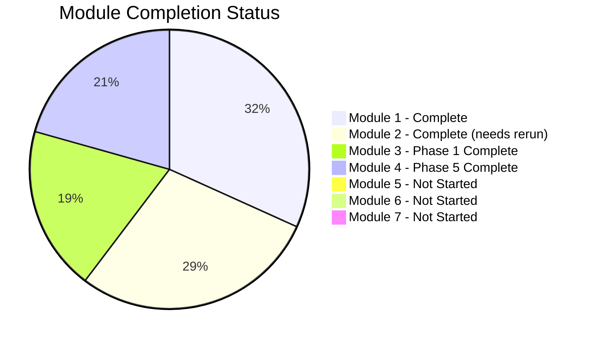
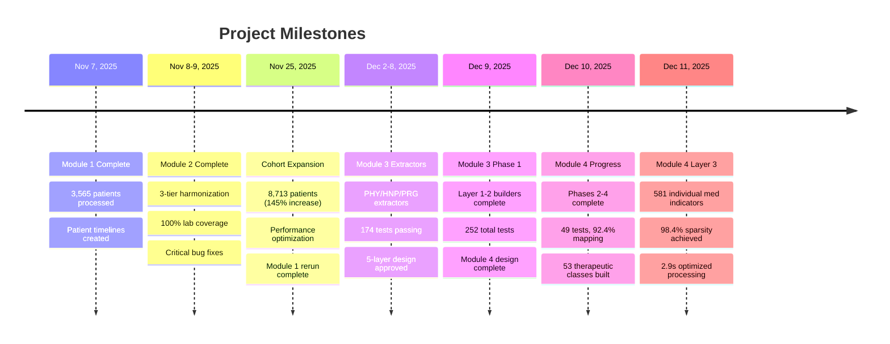

# Project Progress Tracker
*Last Updated: 2025-12-11*

## Overall Project Status

```mermaid
gantt
    title PE Trajectory Data Analysis Pipeline
    dateFormat  YYYY-MM-DD

    section Module 1
    Core Infrastructure Design     :done, m1d, 2025-11-07, 1d
    Patient Timeline Creation      :done, m1a, 2025-11-07, 1d
    Outcome Extraction            :done, m1b, 2025-11-07, 1d
    Performance Optimization      :done, m1c, 2025-11-25, 1d
    Expanded Cohort Rerun         :done, m1e, 2025-11-25, 1d

    section Module 2
    Lab Harmonization Design       :done, m2d, 2025-11-08, 1d
    Three-Tier LOINC Matching     :done, m2a, 2025-11-08, 1d
    Feature Engineering           :done, m2b, 2025-11-08, 1d
    Bug Fixes & Cleanup           :done, m2c, 2025-11-09, 1d
    Rerun on Expanded Cohort      :pending, m2e, after m1e, 1d

    section Module 3
    Vitals 5-Layer Design          :done, m3d, 2025-12-08, 1d
    Extractors (PHY/HNP/PRG)       :done, m3a, 2025-12-02, 3d
    Layer 1-2 Builders             :done, m3b, 2025-12-09, 1d
    Layer 3 Feature Engineering    :pending, m3c, after m3b, 1d
    Layers 4-5 Embeddings          :pending, m3e, after m3c, 1d

    section Module 4
    Medications 5-Layer Design     :done, m4d, 2025-12-08, 1d
    Phase 1: Setup & RxNorm DB     :done, m4a, 2025-12-09, 1d
    Phase 2: Layer 1 Extraction    :done, m4b, 2025-12-10, 1d
    Phase 3: RxNorm Mapping        :done, m4c, 2025-12-10, 1d
    Phase 4: Layer 2 Classes       :done, m4d2, 2025-12-10, 1d
    Phase 5: Layer 3 Individual    :done, m4e, 2025-12-11, 1d
    Phases 6-8: Layers 4-5         :pending, m4f, after m4e, 2d

    section Module 5
    Diagnoses/Procedures          :pending, m5a, after m4e, 2d

    section Module 6
    Temporal Alignment            :pending, m6a, after m5a, 2d

    section Module 7
    Trajectory Engineering        :pending, m7a, after m6a, 3d
```

## Module Completion Status



## Detailed Module Status

### Module 1: Core Infrastructure - COMPLETE ✅

| Task | Status | Date | Notes |
|------|--------|------|-------|
| Design patient timeline structure | Complete | Nov 7 | PatientTimeline dataclass |
| Implement cohort loading | Complete | Nov 7 | Gemma PE-positive filter |
| 4-tier encounter matching | Complete | Nov 7 | 99.5% Tier 1 match rate |
| Mortality extraction | Complete | Nov 7 | 30d/90d/1yr windows |
| ICU admission extraction | Complete | Nov 7 | CPT codes for critical care |
| Ventilation extraction | Complete | Nov 7 | Intubation + mechanical vent |
| Dialysis extraction | Complete | Nov 7 | CRRT, HD, PD codes |
| Advanced interventions | Complete | Nov 7 | IVC filter, CDT, ECMO, etc. |
| Vasopressor/inotrope extraction | Complete | Nov 7 | 10 agent categories |
| Bleeding event extraction | Complete | Nov 7 | ICH, GI, acute blood loss |
| Readmission/shock extraction | Complete | Nov 7 | 30-day windows |
| Performance optimization | Complete | Nov 25 | Pre-grouping by EMPI |
| tqdm progress bars | Complete | Nov 25 | All 10 loops |
| Expanded cohort rerun | Complete | Nov 25 | 8,713 patients |

**Output:** 8,713 patients, 33 MB outcomes.csv, 36 MB patient_timelines.pkl

### Module 2: Laboratory Processing - COMPLETE ✅ (needs rerun)

| Task | Status | Date | Notes |
|------|--------|------|-------|
| Tier 1: LOINC exact matching | Complete | Nov 8 | 96.7% coverage |
| Tier 2: LOINC family matching | Complete | Nov 8 | 0% (expected) |
| Tier 3: Hierarchical clustering | Complete | Nov 8 | 3.3% coverage |
| Harmonization map generation | Complete | Nov 8 | 48 test groups |
| Phase 2: Feature extraction | Complete | Nov 8 | 72 features/test |
| Bug fix: dictionary overwrite | Complete | Nov 9 | Critical fix |
| POC variant consolidation | Complete | Nov 9 | 26 tests merged |
| HDF5 saving fix | Complete | Nov 9 | Name sanitization |
| Interactive visualizations | Complete | Nov 9 | Plotly dashboards |
| Rerun on expanded cohort | Pending | - | 8,713 patients |

**Previous Output:** 3,565 patients, 35 MB features.csv, 646 MB sequences.h5

### Module 3: Vitals Processing - Phase 1 COMPLETE ✅

| Task | Status | Date | Notes |
|------|--------|------|-------|
| 5-Layer Architecture Design | Complete | Dec 8 | Approved design doc |
| Submodule 3.1: PHY Extractor | Complete | Nov 25 | 39 tests, structured vitals |
| Submodule 3.2: HNP Extractor | Complete | Dec 2 | 74 tests, H&P NLP |
| Submodule 3.3: PRG Extractor | Complete | Dec 8 | 61 tests, Progress notes NLP |
| Submodule 3.4: Layer 1 Builder | Complete | Dec 9 | 17 tests, canonical records |
| Submodule 3.5: Layer 2 Builder | Complete | Dec 9 | 17 tests, hourly grid + HDF5 |
| Processing helpers | Complete | Dec 9 | unit_converter, qc_filters, temporal_aligner |
| Submodule 3.6: Layer 3 Features | Pending | - | Rolling stats, trends |
| Submodules 3.7-3.8: Layers 4-5 | Pending | - | Embeddings, world models |

**Tests:** 252 total (174 extractors + 78 processing)
**Output:** `canonical_vitals.parquet`, `hourly_grid.parquet`, `hourly_tensors.h5`

### Module 4: Medication Processing - Phase 5 COMPLETE ✅

| Task | Status | Date | Notes |
|------|--------|------|-------|
| 5-Layer Architecture Design | Complete | Dec 8 | 53 therapeutic classes |
| Phase 1: Setup | Complete | Dec 9 | RxNorm DB, config files |
| Phase 2: Layer 1 Extraction | Complete | Dec 10 | 25 tests, 89.9% parsing |
| Phase 3: RxNorm Mapping | Complete | Dec 10 | 10 tests, 92.4% record mapping |
| Phase 4: Layer 2 Classes | Complete | Dec 10 | 14 tests, 53 classes, 25K rows |
| Phase 5: Layer 3 Individual | Complete | Dec 11 | 4 tests, 581 meds, 98.4% sparse |
| Phase 6: Layer 4 Embeddings | Pending | - | 5 embedding types |
| Phase 7: Layer 5 Dose Intensity | Pending | - | Raw, DDD, weight-adjusted |
| Phase 8: Exporters | Pending | - | GBTM, GRU-D, XGBoost exports |

**Tests:** 53 total (18 dose + 5 canonical + 2 vocab + 10 rxnorm + 14 class + 4 individual)
**Output:**
- `data/bronze/canonical_records.parquet` (23 MB, 1.71M records)
- `data/silver/mapped_medications.parquet` (32 MB, 92.4% mapped)
- `data/gold/therapeutic_classes/class_indicators.parquet` (25K patient-windows)
- `data/gold/individual_indicators/individual_indicators.parquet` (26K × 1,747)
- `data/gold/individual_indicators/individual_indicators_sparse.h5` (98.4% sparse)

### Modules 5-7: Future Work

| Module | Status | Description |
|--------|--------|-------------|
| Module 5 | Pending | Diagnoses/procedures processing |
| Module 6 | Pending | Temporal alignment across modalities |
| Module 7 | Pending | Trajectory feature engineering |

## Key Milestones



## Cohort Statistics

| Metric | Previous (Nov 9) | Current (Nov 25+) | Change |
|--------|------------------|-------------------|--------|
| Total Patients | 3,565 | 8,713 | +145% |
| PE Events | 3,565 | 8,713 | +145% |
| 30d Mortality | ~10% | 11.2% | +1.2pp |
| ICU Admission | ~35% | 35.8% | +0.8pp |
| Vasopressor Use | ~25% | 26.7% | +1.7pp |
| Lab Measurements | 7.6M | TBD | - |
| Medication Records | - | 1.71M | New |
| Unique Medications | - | 10,879 | New |

## Test Coverage Summary

| Module | Test Files | Tests | Status |
|--------|------------|-------|--------|
| Module 1 | - | - | No formal tests |
| Module 2 | - | - | No formal tests |
| Module 3 | 9 files | 252 | ✅ All Pass |
| Module 4 | 6 files | 53 | ✅ All Pass |
| **Total** | **15 files** | **305** | **✅ All Pass** |

## Technical Debt & Issues

| Issue | Severity | Status | Notes |
|-------|----------|--------|-------|
| HDF5 group name collision | Low | Fixed | Sanitize names with `/` |
| Dictionary overwrite bug | Critical | Fixed | Use groupby aggregation |
| POC variant fragmentation | Medium | Fixed | Manual consolidation |
| Module 2 needs rerun | Medium | Pending | On expanded cohort |
| Pickle loading context | Low | Fixed | Inject class into `__main__` |

## Next Actions

1. **Immediate:** Module 4 Phase 6 - Layer 4 Embeddings (Semantic, Ontological, Co-occurrence)
2. **Short-term:** Module 4 Phases 7-8 (Dose Intensity, Exporters)
3. **Medium-term:** Module 3 Layers 3-5 (Feature Engineering, Embeddings)
4. **Long-term:** Modules 5-7, ML model development

---

*Version: 5.0 | Updated: 2025-12-11*
